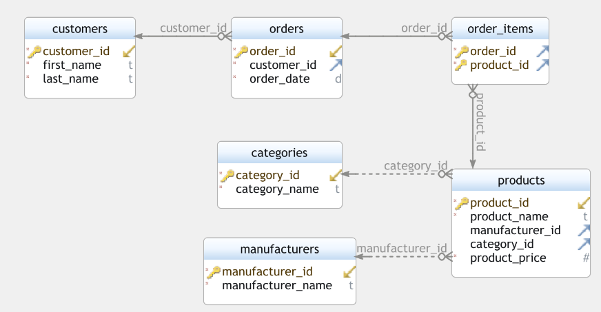

<h1>Database of web store</h1>

A small database created by the prototype of the web store

## 📌 Technologies

- [PostgreSQL 15](https://www.postgresql.org/) - a powerful, open source object-relational database system
- [DbSchema](https://dbschema.com/) - a database design tool
- [iPython-SQL](https://github.com/catherinedevlin/ipython-sql)
- [Jupyter](https://jupyter.org/)
